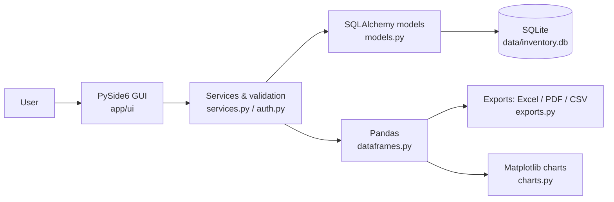

# Inventory Management System

   

**Course:** BBAT104 Fundamentals of TQM (Session 2026-27)
**Project code:** Q10 - **Quality goal:** *Improve Documentation*
**Student:** Your Name | **Reg. No.:** Your Reg. No.

## Contents
- [Features](#features)
- [Quick start](#quick-start)
- [Architecture](#architecture)
- [Q10 documentation features](#q10-documentation-features)
- [TQM tools](#tqm-tools)
- [Project structure](#project-structure)
- [Tests](#tests)
- [Progress checklist](#progress-checklist)

## Features
- Products, categories and suppliers with full CRUD and live search
- Stock In / Stock Out with history and low-stock highlighting
- Role-based login (bcrypt-hashed passwords), audit log
- Excel, PDF and CSV reports; one-click database backup
- Dashboard with Matplotlib chart
- Quality page: Defect Log, FMEA (RPN), Pareto chart, Fishbone diagram

## Quick start
```bash
git clone https://github.com/<your-username>/BBAT104_TQM_<RegNo>.git
cd BBAT104_TQM_<RegNo>
python -m venv .venv
.venv\Scripts\activate          # Windows   (Linux/macOS: source .venv/bin/activate)
pip install -r requirements.txt
python main.py
```
Default login: `admin` / `Admin@123` (change it in the Users page).

<details>
<summary><b>Screenshots</b> (click to expand - add your own images to <code>docs/screenshots/</code>)</summary>

| Dashboard | Products | Quality |
| --- | --- | --- |
|  |  |  |

</details>

## Architecture


## Q10 documentation features
| # | Feature | Where to find it |
| --- | --- | --- |
| 1 | Interactive README | This file (TOC, collapsible sections, Mermaid diagram, checklist) |
| 2 | User Manual | `docs/USER_MANUAL.md` and *Help & FAQ > User Manual* in the app |
| 3 | Help / FAQ screen | *Help & FAQ* page, shortcut **F1** (content in `app/help_content.py`) |
| 4 | About page | *About* page in the app (`app/ui/about_page.py`) |
| 5 | Inline code comments | Docstrings and comments in every module |

## TQM tools
<details>
<summary><b>FMEA, Pareto, Fishbone, Checksheet, PDCA</b></summary>

- **Checksheet / Defect log:** Quality > Defect Log
- **FMEA:** Quality > FMEA, RPN = S x O x D, sorted by risk
- **Pareto (80/20):** Quality > SQC Charts > Pareto chart
- **Fishbone:** Quality > SQC Charts > Fishbone diagram (People, Process, Software Code, Infrastructure)
- **Poka-Yoke:** dropdowns, spin boxes, required fields, unique SKU, blocked over-issue, delete confirmation
- **PDCA:** record each improvement cycle in `docs/PDCA_LOG.md`

</details>

## Project structure
```
main.py                  entry point
app/
  config.py              project metadata
  db.py  models.py       engine + ORM tables
  auth.py                bcrypt login, audit log
  services.py            validated CRUD, stock, backup
  dataframes.py          Pandas data frames
  exports.py  charts.py  Excel/PDF/CSV, Matplotlib
  help_content.py        FAQ + tooltips text
  ui/                    GUI pages and widgets
docs/USER_MANUAL.md      user manual
tests/test_services.py   unit tests
```

## Tests
```bash
pytest -q
```

## Progress checklist
- [ ] Review 1: repo, SRS, architecture flowchart
- [ ] Review 2: CRUD + 5 Q10 features
- [ ] Review 3: FMEA, SIPOC, CTQ tree, defect log
- [ ] Review 4: Pareto, Fishbone, checksheets, PDCA
- [ ] Final demo and viva
- [ ] 30+ commits, screenshots added
